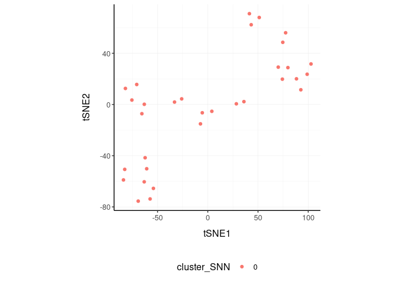
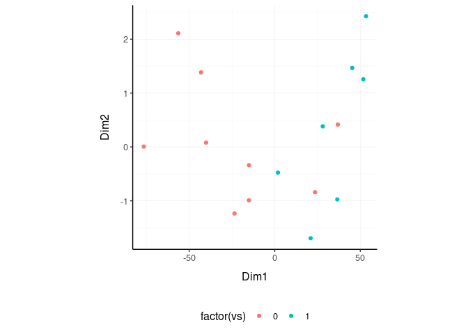

nanny - tidyverse style high-level data analysis and manipulations
================

<!-- badges: start -->

[](https://www.tidyverse.org/lifecycle/#maturing)
<!-- badges: end -->

<!---

[](https://travis-ci.org/stemangiola/nanny) [](https://coveralls.io/github/stemangiola/nanny?branch=master)

-->

# 

# Installation

``` r
devtools::install_github("stemangiola/nanny")
```

# Introduction

nanny is a collection of wrapper functions for high level data analysis
and manipulation following the tidy paradigm.

# Tidy data

``` r
mtcars_tidy = 
    mtcars %>% 
    as_tibble(rownames="car_model") %>% 
    gather(feature, value, -car_model, -hp, -vs)

mtcars_tidy
```

    ## # A tibble: 288 x 5
    ##    car_model            hp    vs feature value
    ##    <chr>             <dbl> <dbl> <chr>   <dbl>
    ##  1 Mazda RX4           110     0 mpg      21  
    ##  2 Mazda RX4 Wag       110     0 mpg      21  
    ##  3 Datsun 710           93     1 mpg      22.8
    ##  4 Hornet 4 Drive      110     1 mpg      21.4
    ##  5 Hornet Sportabout   175     0 mpg      18.7
    ##  6 Valiant             105     1 mpg      18.1
    ##  7 Duster 360          245     0 mpg      14.3
    ##  8 Merc 240D            62     1 mpg      24.4
    ##  9 Merc 230             95     1 mpg      22.8
    ## 10 Merc 280            123     1 mpg      19.2
    ## # … with 278 more rows

# Reduce `dimensions`

We may want to reduce the dimensions of our data, for example using PCA,
MDS of tSNE algorithms. `reduce_dimensions` takes a tibble, column names
(as symbols; for `element`, `feature` and `value`) and a method (e.g.,
MDS, PCA or tSNE) as arguments and returns a tibble with additional
columns for the reduced dimensions.

**MDS** (Robinson et al., 10.1093/bioinformatics/btp616)

``` r
mtcars_tidy_MDS =
  mtcars_tidy %>%
  reduce_dimensions(car_model, feature, value, method="MDS", .dims = 3)
```

On the x and y axes axis we have the reduced dimensions 1 to 3, data is
coloured by cell
type.

``` r
mtcars_tidy_MDS %>% subset(car_model)  %>% select(contains("Dim"), everything())
```

    ## # A tibble: 32 x 6
    ##      Dim1   Dim2    Dim3 car_model            hp    vs
    ##     <dbl>  <dbl>   <dbl> <chr>             <dbl> <dbl>
    ##  1  23.6  -0.856  0.641  Mazda RX4           110     0
    ##  2  23.6  -0.840  0.490  Mazda RX4 Wag       110     0
    ##  3  40.9  -0.625 -0.402  Datsun 710           93     1
    ##  4  -9.06  1.02  -0.683  Hornet 4 Drive      110     1
    ##  5 -43.1   1.38   0.0652 Hornet Sportabout   175     0
    ##  6   1.88 -0.477 -1.18   Valiant             105     1
    ##  7 -43.1  -0.226  0.357  Duster 360          245     0
    ##  8  28.1   0.382 -0.521  Merc 240D            62     1
    ##  9  30.0  -0.103 -1.37   Merc 230             95     1
    ## 10  21.0  -1.27  -0.0367 Merc 280            123     1
    ## # … with 22 more rows

``` r
mtcars_tidy_MDS %>%
    subset(car_model) %>%
  GGally::ggpairs(columns = 4:6, ggplot2::aes(colour=factor(vs)))
```

<!-- -->

**PCA**

``` r
mtcars_tidy_PCA =
  mtcars_tidy %>%
  reduce_dimensions(car_model, feature, value, method="PCA", .dims = 3)
```

On the x and y axes axis we have the reduced dimensions 1 to 3, data is
coloured by cell
type.

``` r
mtcars_tidy_PCA %>% subset(car_model) %>% select(contains("PC"), everything())
```

    ## # A tibble: 32 x 6
    ##      PC1     PC2      PC3 car_model            hp    vs
    ##    <dbl>   <dbl>    <dbl> <chr>             <dbl> <dbl>
    ##  1 0.178 -0.0196 -0.0582  Mazda RX4           110     0
    ##  2 0.178 -0.0183 -0.0184  Mazda RX4 Wag       110     0
    ##  3 0.178  0.118   0.250   Datsun 710           93     1
    ##  4 0.178 -0.0754 -0.00172 Hornet 4 Drive      110     1
    ##  5 0.177 -0.126  -0.126   Hornet Sportabout   175     0
    ##  6 0.178 -0.0733  0.165   Valiant             105     1
    ##  7 0.177 -0.145  -0.101   Duster 360          245     0
    ##  8 0.178  0.0488  0.149   Merc 240D            62     1
    ##  9 0.178  0.0561  0.456   Merc 230             95     1
    ## 10 0.178 -0.0353  0.128   Merc 280            123     1
    ## # … with 22 more rows

``` r
mtcars_tidy_PCA %>%
     subset(car_model) %>%
  GGally::ggpairs(columns = 4:6, ggplot2::aes(colour=factor(vs)))
```

<!-- -->

**tSNE**

``` r
mtcars_tidy_tSNE =
    mtcars_tidy %>% 
    reduce_dimensions(car_model, feature, value, method = "tSNE")
```

Plot

``` r
mtcars_tidy_tSNE %>%
    subset(car_model) %>%
    select(contains("tSNE"), everything()) 
```

    ## # A tibble: 32 x 5
    ##     tSNE1 tSNE2 car_model            hp    vs
    ##     <dbl> <dbl> <chr>             <dbl> <dbl>
    ##  1 -15.0   50.4 Mazda RX4           110     0
    ##  2  -4.44  49.7 Mazda RX4 Wag       110     0
    ##  3  87.2   28.3 Datsun 710           93     1
    ##  4   5.37 -56.9 Hornet 4 Drive      110     1
    ##  5 -79.1  -25.0 Hornet Sportabout   175     0
    ##  6  16.2  -58.9 Valiant             105     1
    ##  7 -91.0  -22.8 Duster 360          245     0
    ##  8   9.39  42.7 Merc 240D            62     1
    ##  9  19.2   44.9 Merc 230             95     1
    ## 10 -11.1   40.5 Merc 280            123     1
    ## # … with 22 more rows

``` r
mtcars_tidy_tSNE %>%
    subset(car_model) %>%
    ggplot(aes(x = `tSNE1`, y = `tSNE2`, color=factor(vs))) + geom_point() + my_theme
```

<!-- -->

# Rotate `dimensions`

We may want to rotate the reduced dimensions (or any two numeric columns
really) of our data, of a set angle. `rotate_dimensions` takes a tibble,
column names (as symbols; for `element`, `feature` and `value`) and an
angle as arguments and returns a tibble with additional columns for the
rotated dimensions. The rotated dimensions will be added to the original
data set as `<NAME OF DIMENSION> rotated <ANGLE>` by default, or as
specified in the input arguments.

``` r
mtcars_tidy_MDS.rotated =
  mtcars_tidy_MDS %>%
    rotate_dimensions(`Dim1`, `Dim2`, .element = car_model, rotation_degrees = 45, action="get")
```

**Original** On the x and y axes axis we have the first two reduced
dimensions, data is coloured by cell type.

``` r
mtcars_tidy_MDS.rotated %>%
    ggplot(aes(x=`Dim1`, y=`Dim2`, color=factor(vs) )) +
  geom_point() +
  my_theme
```

<!-- -->

**Rotated** On the x and y axes axis we have the first two reduced
dimensions rotated of 45 degrees, data is coloured by cell type.

``` r
mtcars_tidy_MDS.rotated %>%
    ggplot(aes(x=`Dim1 rotated 45`, y=`Dim2 rotated 45`, color=factor(vs) )) +
  geom_point() +
  my_theme
```

<!-- -->

# Cluster `elements`

We may want to cluster our data (e.g., using k-means element-wise).
`cluster_elements` takes as arguments a tibble, column names (as
symbols; for `element`, `feature` and `value`) and returns a tibble with
additional columns for the cluster annotation. At the moment only
k-means clustering is supported, the plan is to introduce more
clustering methods.

**k-means**

``` r
mtcars_tidy_cluster = mtcars_tidy_MDS %>%
  cluster_elements(car_model, feature, value, method="kmeans",  centers = 2, action="get" )
```

We can add cluster annotation to the MDS dimesion reduced data set and
plot.

``` r
 mtcars_tidy_cluster %>%
    ggplot(aes(x=`Dim1`, y=`Dim2`, color=cluster_kmeans)) +
  geom_point() +
  my_theme
```

<!-- -->

**SNN**

``` r
mtcars_tidy_SNN =
    mtcars_tidy_tSNE %>%
    cluster_elements(car_model, feature, value, method = "SNN")
```

``` r
mtcars_tidy_SNN %>%
    subset(car_model) %>%
    select(contains("tSNE"), everything()) 
```

    ## # A tibble: 32 x 6
    ##     tSNE1 tSNE2 car_model            hp    vs cluster_SNN
    ##     <dbl> <dbl> <chr>             <dbl> <dbl> <fct>      
    ##  1 -15.0   50.4 Mazda RX4           110     0 <NA>       
    ##  2  -4.44  49.7 Mazda RX4 Wag       110     0 <NA>       
    ##  3  87.2   28.3 Datsun 710           93     1 <NA>       
    ##  4   5.37 -56.9 Hornet 4 Drive      110     1 <NA>       
    ##  5 -79.1  -25.0 Hornet Sportabout   175     0 <NA>       
    ##  6  16.2  -58.9 Valiant             105     1 0          
    ##  7 -91.0  -22.8 Duster 360          245     0 <NA>       
    ##  8   9.39  42.7 Merc 240D            62     1 <NA>       
    ##  9  19.2   44.9 Merc 230             95     1 <NA>       
    ## 10 -11.1   40.5 Merc 280            123     1 <NA>       
    ## # … with 22 more rows

``` r
mtcars_tidy_SNN %>%
    subset(car_model) %>%
    ggplot(aes(x = `tSNE1`, y = `tSNE2`, color=cluster_SNN)) + geom_point() + my_theme
```

<!-- -->

# Drop `redundant` features

We may want to remove redundant elements from the original data set
(e.g., elements or features), for example if we want to define cell-type
specific signatures with low element redundancy. `remove_redundancy`
takes as arguments a tibble, column names (as symbols; for `element`,
`feature` and `value`) and returns a tibble dropped recundant elements
(e.g., elements). Two redundancy estimation approaches are supported:

  - removal of highly correlated clusters of elements (keeping a
    representative) with method=“correlation”
  - removal of most proximal element pairs in a reduced dimensional
    space.

**Approach 1**

``` r
mtcars_tidy_non_redundant =
    mtcars_tidy_MDS %>%
  remove_redundancy(car_model, feature, value,  method = "correlation" )
```

We can visualise how the reduced redundancy with the reduced dimentions
look like

``` r
mtcars_tidy_non_redundant %>%
    subset(car_model) %>%
    ggplot(aes(x=`Dim1`, y=`Dim2`, color=factor(vs))) +
  geom_point() +
  my_theme
```

<!-- -->

**Approach 2**

``` r
mtcars_tidy_non_redundant =
    mtcars_tidy_MDS %>%
  remove_redundancy(
    car_model, feature, value, 
    method = "reduced_dimensions",
    Dim_a_column = `Dim1`,
    Dim_b_column = `Dim2`
  )
```

We can visualise MDS reduced dimensions of the elements with the closest
pair removed.

``` r
mtcars_tidy_non_redundant %>%
    subset(car_model) %>%
    ggplot(aes(x=`Dim1`, y=`Dim2`, color=factor(vs))) +
  geom_point() +
  my_theme
```

<!-- -->

# ADD versus GET versus ONLY modes

Every function takes a tidyfeatureomics structured data as input, and
(i) with action=“add” outputs the new information joint to the original
input data frame (default), (ii) with action=“get” the new information
with the element or feature relative informatin depending on what the
analysis is about, or (iii) with action=“only” just the new information.
For example, from this data set

``` r
  mtcars_tidy
```

    ## # A tibble: 288 x 5
    ##    car_model            hp    vs feature value
    ##    <chr>             <dbl> <dbl> <chr>   <dbl>
    ##  1 Mazda RX4           110     0 mpg      21  
    ##  2 Mazda RX4 Wag       110     0 mpg      21  
    ##  3 Datsun 710           93     1 mpg      22.8
    ##  4 Hornet 4 Drive      110     1 mpg      21.4
    ##  5 Hornet Sportabout   175     0 mpg      18.7
    ##  6 Valiant             105     1 mpg      18.1
    ##  7 Duster 360          245     0 mpg      14.3
    ##  8 Merc 240D            62     1 mpg      24.4
    ##  9 Merc 230             95     1 mpg      22.8
    ## 10 Merc 280            123     1 mpg      19.2
    ## # … with 278 more rows

**action=“add”** (Default) We can add the MDS dimensions to the original
data set

``` r
  mtcars_tidy %>%
    reduce_dimensions(
        car_model, feature, value, 
        method="MDS" ,
        .dims = 3,
        action="add"
    )
```

    ## # A tibble: 288 x 8
    ##    car_model            hp    vs feature value   Dim1   Dim2    Dim3
    ##    <chr>             <dbl> <dbl> <chr>   <dbl>  <dbl>  <dbl>   <dbl>
    ##  1 Mazda RX4           110     0 mpg      21    23.6  -0.856  0.641 
    ##  2 Mazda RX4 Wag       110     0 mpg      21    23.6  -0.840  0.490 
    ##  3 Datsun 710           93     1 mpg      22.8  40.9  -0.625 -0.402 
    ##  4 Hornet 4 Drive      110     1 mpg      21.4  -9.06  1.02  -0.683 
    ##  5 Hornet Sportabout   175     0 mpg      18.7 -43.1   1.38   0.0652
    ##  6 Valiant             105     1 mpg      18.1   1.88 -0.477 -1.18  
    ##  7 Duster 360          245     0 mpg      14.3 -43.1  -0.226  0.357 
    ##  8 Merc 240D            62     1 mpg      24.4  28.1   0.382 -0.521 
    ##  9 Merc 230             95     1 mpg      22.8  30.0  -0.103 -1.37  
    ## 10 Merc 280            123     1 mpg      19.2  21.0  -1.27  -0.0367
    ## # … with 278 more rows

**action=“get”** We can add the MDS dimensions to the original data set
selecting just the element-wise column

``` r
  mtcars_tidy %>%
    reduce_dimensions(
        car_model, feature, value, 
        method="MDS" ,
        .dims = 3,
        action="get"
    )
```

    ## # A tibble: 32 x 6
    ##    car_model            hp    vs   Dim1   Dim2    Dim3
    ##    <chr>             <dbl> <dbl>  <dbl>  <dbl>   <dbl>
    ##  1 Mazda RX4           110     0  23.6  -0.856  0.641 
    ##  2 Mazda RX4 Wag       110     0  23.6  -0.840  0.490 
    ##  3 Datsun 710           93     1  40.9  -0.625 -0.402 
    ##  4 Hornet 4 Drive      110     1  -9.06  1.02  -0.683 
    ##  5 Hornet Sportabout   175     0 -43.1   1.38   0.0652
    ##  6 Valiant             105     1   1.88 -0.477 -1.18  
    ##  7 Duster 360          245     0 -43.1  -0.226  0.357 
    ##  8 Merc 240D            62     1  28.1   0.382 -0.521 
    ##  9 Merc 230             95     1  30.0  -0.103 -1.37  
    ## 10 Merc 280            123     1  21.0  -1.27  -0.0367
    ## # … with 22 more rows

**action=“only”** We can get just the MDS dimensions relative to each
element

``` r
  mtcars_tidy %>%
    reduce_dimensions(
        car_model, feature, value, 
        method="MDS" ,
        .dims = 3,
        action="only"
    )
```

    ## # A tibble: 32 x 4
    ##    car_model           Dim1   Dim2    Dim3
    ##    <chr>              <dbl>  <dbl>   <dbl>
    ##  1 AMC Javelin        -24.5 -0.521 -0.316 
    ##  2 Cadillac Fleetwood -80.5  0.188 -0.466 
    ##  3 Camaro Z28         -39.8 -0.705  0.387 
    ##  4 Chrysler Imperial  -69.8  1.07  -0.0145
    ##  5 Datsun 710          40.9 -0.625 -0.402 
    ##  6 Dodge Challenger   -29.1 -0.244 -0.189 
    ##  7 Duster 360         -43.1 -0.226  0.357 
    ##  8 Ferrari Dino        28.5 -1.70   1.17  
    ##  9 Fiat 128            50.8  2.04   0.107 
    ## 10 Fiat X1-9           50.6  0.407 -0.131 
    ## # … with 22 more rows
