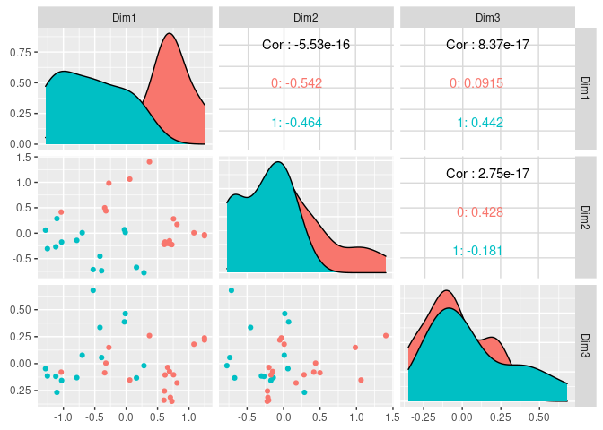
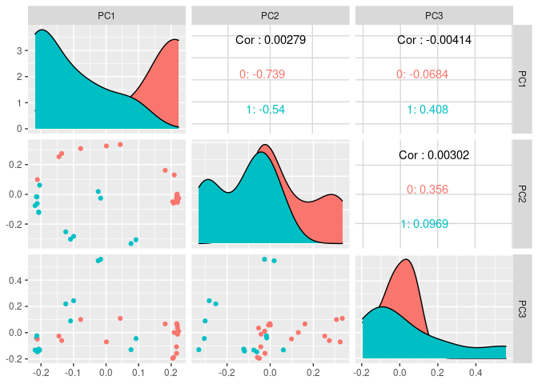
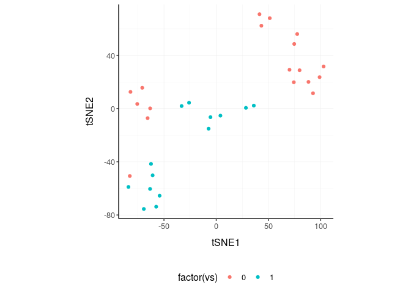
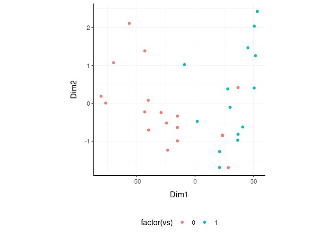
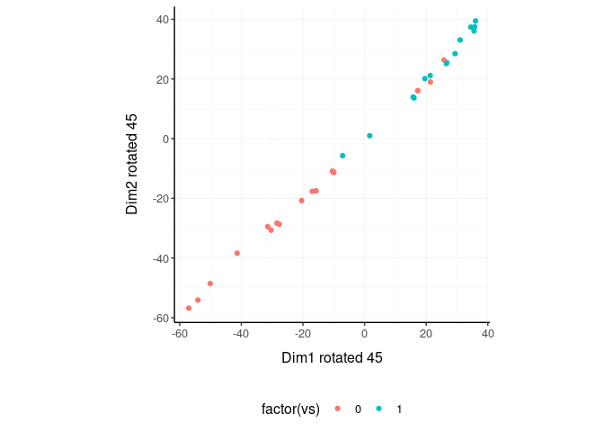
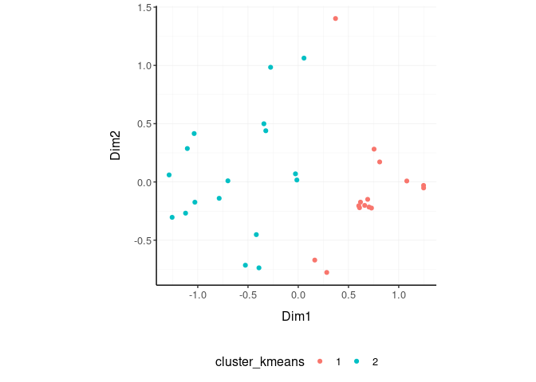
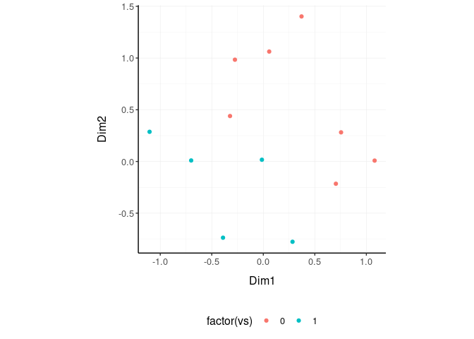

nanny: high-level data analysis and manipulations in tidyverse style
================

<!-- badges: start -->

[](https://www.tidyverse.org/lifecycle/#maturing)
<!-- badges: end -->

<!---

[](https://travis-ci.org/stemangiola/nanny) [](https://coveralls.io/github/stemangiola/nanny?branch=master)

-->

# 

## Functions/utilities available

| Function            | Description                                                             |
| ------------------- | ----------------------------------------------------------------------- |
| `reduce_dimensions` | Perform dimensionality reduction (PCA, MDS, tSNE)                       |
| `rotate_dimensions` | Rotate two dimensions of a degree                                       |
| `cluster_elements`  | Labels elements with cluster identity                                   |
| `remove_redundancy` | Filter out elements with highly correlated features                     |
| `fill_missing`      | Fill values of missing element/feature pairs                            |
| `impute_missing`    | Impute values of missing element/feature pairs                          |
| `permute_nest`      | From one column build a two permuted columns with nested information    |
| `combine_nest`      | From one column build a two combination columns with nested information |
| `keep_variable`     | Keep top variable features                                              |
| `lower_triangular`  | keep rows corresponding to a lower triangular matrix                    |

| Utilities   | Description                                                      |
| ----------- | ---------------------------------------------------------------- |
| `as_matrix` | Robustly convert a tibble to matrix                              |
| `subset`    | Select columns with information relative to a column of interest |

## Minimal input data frame

| element         | feature         | value     |
| --------------- | --------------- | --------- |
| `chr` or `fctr` | `chr` or `fctr` | `numeric` |

## Output data frame

| element         | feature         | value     | new information |
| --------------- | --------------- | --------- | --------------- |
| `chr` or `fctr` | `chr` or `fctr` | `numeric` | …               |

## Installation

``` r
devtools::install_github("stemangiola/nanny")
```

## Introduction

nanny is a collection of wrapper functions for high level data analysis
and manipulation following the tidy paradigm.

## Tidy data

``` r
mtcars_tidy = 
    mtcars %>% 
    as_tibble(rownames="car_model") %>% 
    mutate_at(vars(-car_model,- hp, -vs), scale) %>%
    gather(feature, value, -car_model, -hp, -vs)

mtcars_tidy
```

    ## # A tibble: 288 x 5
    ##    car_model            hp    vs feature  value
    ##    <chr>             <dbl> <dbl> <chr>    <dbl>
    ##  1 Mazda RX4           110     0 mpg      0.151
    ##  2 Mazda RX4 Wag       110     0 mpg      0.151
    ##  3 Datsun 710           93     1 mpg      0.450
    ##  4 Hornet 4 Drive      110     1 mpg      0.217
    ##  5 Hornet Sportabout   175     0 mpg     -0.231
    ##  6 Valiant             105     1 mpg     -0.330
    ##  7 Duster 360          245     0 mpg     -0.961
    ##  8 Merc 240D            62     1 mpg      0.715
    ##  9 Merc 230             95     1 mpg      0.450
    ## 10 Merc 280            123     1 mpg     -0.148
    ## # … with 278 more rows

## Reduce `dimensions`

We may want to reduce the dimensions of our data, for example using PCA,
MDS of tSNE algorithms. `reduce_dimensions` takes a tibble, column names
(as symbols; for `element`, `feature` and `value`) and a method (e.g.,
MDS, PCA or tSNE) as arguments and returns a tibble with additional
columns for the reduced dimensions.

**MDS** (Robinson et al., 10.1093/bioinformatics/btp616)

``` r
mtcars_tidy_MDS =
  mtcars_tidy %>%
  reduce_dimensions(car_model, feature, value, method="MDS", .dims = 3)
```

On the x and y axes axis we have the reduced dimensions 1 to 3, data is
coloured by cell
type.

``` r
mtcars_tidy_MDS %>% subset(car_model)  %>% select(contains("Dim"), everything())
```

    ## # A tibble: 32 x 6
    ##       Dim1    Dim2     Dim3 car_model            hp    vs
    ##      <dbl>   <dbl>    <dbl> <chr>             <dbl> <dbl>
    ##  1 -0.342   0.499  -0.0853  Mazda RX4           110     0
    ##  2 -0.323   0.439   0.00461 Mazda RX4 Wag       110     0
    ##  3 -0.787  -0.140  -0.130   Datsun 710           93     1
    ##  4  0.164  -0.670  -0.133   Hornet 4 Drive      110     1
    ##  5  0.602  -0.205  -0.339   Hornet Sportabout   175     0
    ##  6  0.284  -0.777  -0.0186  Valiant             105     1
    ##  7  0.810   0.172  -0.179   Duster 360          245     0
    ##  8 -0.417  -0.452   0.335   Merc 240D            62     1
    ##  9 -0.526  -0.715   0.679   Merc 230             95     1
    ## 10 -0.0277  0.0696  0.387   Merc 280            123     1
    ## # … with 22 more rows

``` r
mtcars_tidy_MDS %>%
    subset(car_model) %>%
  GGally::ggpairs(columns = 4:6, ggplot2::aes(colour=factor(vs)))
```

<!-- -->

**PCA**

``` r
mtcars_tidy_PCA =
  mtcars_tidy %>%
  reduce_dimensions(car_model, feature, value, method="PCA", .dims = 3)
```

On the x and y axes axis we have the reduced dimensions 1 to 3, data is
coloured by cell
type.

``` r
mtcars_tidy_PCA %>% subset(car_model) %>% select(contains("PC"), everything())
```

    ## # A tibble: 32 x 6
    ##        PC1     PC2       PC3 car_model            hp    vs
    ##      <dbl>   <dbl>     <dbl> <chr>             <dbl> <dbl>
    ##  1 -0.136   0.274  -0.0602   Mazda RX4           110     0
    ##  2 -0.145   0.253  -0.0261   Mazda RX4 Wag       110     0
    ##  3 -0.212  -0.0619 -0.146    Datsun 710           93     1
    ##  4  0.0767 -0.331  -0.130    Hornet 4 Drive      110     1
    ##  5  0.205  -0.0498 -0.196    Hornet Sportabout   175     0
    ##  6  0.0920 -0.306  -0.0449   Valiant             105     1
    ##  7  0.210   0.130   0.000724 Duster 360          245     0
    ##  8 -0.124  -0.252   0.219    Merc 240D            62     1
    ##  9 -0.0997 -0.283   0.243    Merc 230             95     1
    ## 10 -0.0242  0.0185  0.547    Merc 280            123     1
    ## # … with 22 more rows

``` r
mtcars_tidy_PCA %>%
     subset(car_model) %>%
  GGally::ggpairs(columns = 4:6, ggplot2::aes(colour=factor(vs)))
```

<!-- -->

**tSNE**

``` r
mtcars_tidy_tSNE =
    mtcars_tidy %>% 
    reduce_dimensions(car_model, feature, value, method = "tSNE")
```

Plot

``` r
mtcars_tidy_tSNE %>%
    subset(car_model) %>%
    select(contains("tSNE"), everything()) 
```

    ## # A tibble: 32 x 5
    ##     tSNE1  tSNE2 car_model            hp    vs
    ##     <dbl>  <dbl> <chr>             <dbl> <dbl>
    ##  1 -13.6   46.8  Mazda RX4           110     0
    ##  2  -8.21  47.1  Mazda RX4 Wag       110     0
    ##  3  36.3   35.7  Datsun 710           93     1
    ##  4  -8.62 -14.9  Hornet 4 Drive      110     1
    ##  5  -6.64 -61.7  Hornet Sportabout   175     0
    ##  6 -10.0  -20.1  Valiant             105     1
    ##  7   6.82 -46.6  Duster 360          245     0
    ##  8  -7.60   7.72 Merc 240D            62     1
    ##  9 -13.8    7.69 Merc 230             95     1
    ## 10 -11.7   27.0  Merc 280            123     1
    ## # … with 22 more rows

``` r
mtcars_tidy_tSNE %>%
    subset(car_model) %>%
    ggplot(aes(x = `tSNE1`, y = `tSNE2`, color=factor(vs))) + geom_point() + my_theme
```

<!-- -->

## Rotate `dimensions`

We may want to rotate the reduced dimensions (or any two numeric columns
really) of our data, of a set angle. `rotate_dimensions` takes a tibble,
column names (as symbols; for `element`, `feature` and `value`) and an
angle as arguments and returns a tibble with additional columns for the
rotated dimensions. The rotated dimensions will be added to the original
data set as `<NAME OF DIMENSION> rotated <ANGLE>` by default, or as
specified in the input arguments.

``` r
mtcars_tidy_MDS.rotated =
  mtcars_tidy_MDS %>%
    rotate_dimensions(`Dim1`, `Dim2`, .element = car_model, rotation_degrees = 45, action="get")
```

**Original** On the x and y axes axis we have the first two reduced
dimensions, data is coloured by cell type.

``` r
mtcars_tidy_MDS.rotated %>%
    ggplot(aes(x=`Dim1`, y=`Dim2`, color=factor(vs) )) +
  geom_point() +
  my_theme
```

<!-- -->

**Rotated** On the x and y axes axis we have the first two reduced
dimensions rotated of 45 degrees, data is coloured by cell type.

``` r
mtcars_tidy_MDS.rotated %>%
    ggplot(aes(x=`Dim1 rotated 45`, y=`Dim2 rotated 45`, color=factor(vs) )) +
  geom_point() +
  my_theme
```

<!-- -->

## Cluster `elements`

We may want to cluster our data (e.g., using k-means element-wise).
`cluster_elements` takes as arguments a tibble, column names (as
symbols; for `element`, `feature` and `value`) and returns a tibble with
additional columns for the cluster annotation. At the moment only
k-means clustering is supported, the plan is to introduce more
clustering methods.

**k-means**

``` r
mtcars_tidy_cluster = mtcars_tidy_MDS %>%
  cluster_elements(car_model, feature, value, method="kmeans",  centers = 2, action="get" )
```

We can add cluster annotation to the MDS dimesion reduced data set and
plot.

``` r
 mtcars_tidy_cluster %>%
    ggplot(aes(x=`Dim1`, y=`Dim2`, color=cluster_kmeans)) +
  geom_point() +
  my_theme
```

<!-- -->

## Drop `redundant` features

We may want to remove redundant elements from the original data set
(e.g., elements or features), for example if we want to define cell-type
specific signatures with low element redundancy. `remove_redundancy`
takes as arguments a tibble, column names (as symbols; for `element`,
`feature` and `value`) and returns a tibble dropped recundant elements
(e.g., elements). Two redundancy estimation approaches are supported:

removal of highly correlated clusters of elements (keeping a
representative) with method=“correlation”

``` r
mtcars_tidy_non_redundant =
    mtcars_tidy_MDS %>%
  remove_redundancy(car_model, feature, value)
```

We can visualise how the reduced redundancy with the reduced dimentions
look like

``` r
mtcars_tidy_non_redundant %>%
    subset(car_model) %>%
    ggplot(aes(x=`Dim1`, y=`Dim2`, color=factor(vs))) +
  geom_point() +
  my_theme
```

<!-- -->

## `fill_missing` element/feature pairs

This function allows to obtain a rectangular underlying data structure,
where every element has one feature

We create a non-rectangular data frame

``` r
mtcars_tidy_non_rectangular = mtcars_tidy %>% slice(-1)
```

We fill the missing value with the value of
0

``` r
mtcars_tidy_non_rectangular %>% fill_missing(car_model, feature, value, fill_with = 0)
```

    ## # A tibble: 288 x 5
    ##    car_model            hp    vs feature  value
    ##    <chr>             <dbl> <dbl> <chr>    <dbl>
    ##  1 Mazda RX4           110     0 mpg      0    
    ##  2 Mazda RX4 Wag       110     0 mpg      0.151
    ##  3 Datsun 710           93     1 mpg      0.450
    ##  4 Hornet 4 Drive      110     1 mpg      0.217
    ##  5 Hornet Sportabout   175     0 mpg     -0.231
    ##  6 Valiant             105     1 mpg     -0.330
    ##  7 Duster 360          245     0 mpg     -0.961
    ##  8 Merc 240D            62     1 mpg      0.715
    ##  9 Merc 230             95     1 mpg      0.450
    ## 10 Merc 280            123     1 mpg     -0.148
    ## # … with 278 more rows

## `impute_missing` element/feature pairs

This function allows to obtain a rectangular underlying data structure,
where every element has one feature

We impute the missing value with the a summary value (median by default)
according to a grouping

``` r
mtcars_tidy_non_rectangular %>% mutate(vs = factor(vs)) %>% 
    impute_missing( ~ vs, car_model, feature, value) %>%
    
    # Print imputed first
    arrange(car_model != "Mazda RX4" | feature != "mpg")
```

    ## # A tibble: 288 x 5
    ##    car_model              hp vs    feature  value
    ##    <chr>               <dbl> <fct> <chr>    <dbl>
    ##  1 Mazda RX4             110 0     mpg     -0.762
    ##  2 Mazda RX4 Wag         110 0     mpg      0.151
    ##  3 Hornet Sportabout     175 0     mpg     -0.231
    ##  4 Duster 360            245 0     mpg     -0.961
    ##  5 Merc 450SE            180 0     mpg     -0.612
    ##  6 Merc 450SL            180 0     mpg     -0.463
    ##  7 Merc 450SLC           180 0     mpg     -0.811
    ##  8 Cadillac Fleetwood    205 0     mpg     -1.61 
    ##  9 Lincoln Continental   215 0     mpg     -1.61 
    ## 10 Chrysler Imperial     230 0     mpg     -0.894
    ## # … with 278 more rows

## `permute_nest`, From one column build a two permuted columns with nested information

``` r
mtcars_tidy_permuted = 
    mtcars_tidy %>%
    permute_nest(car_model, c(feature,value))

mtcars_tidy_permuted
```

    ## # A tibble: 992 x 3
    ##    car_model_1 car_model_2        data             
    ##    <fct>       <fct>              <list>           
    ##  1 AMC Javelin Cadillac Fleetwood <tibble [18 × 3]>
    ##  2 AMC Javelin Camaro Z28         <tibble [18 × 3]>
    ##  3 AMC Javelin Chrysler Imperial  <tibble [18 × 3]>
    ##  4 AMC Javelin Datsun 710         <tibble [18 × 3]>
    ##  5 AMC Javelin Dodge Challenger   <tibble [18 × 3]>
    ##  6 AMC Javelin Duster 360         <tibble [18 × 3]>
    ##  7 AMC Javelin Ferrari Dino       <tibble [18 × 3]>
    ##  8 AMC Javelin Fiat 128           <tibble [18 × 3]>
    ##  9 AMC Javelin Fiat X1-9          <tibble [18 × 3]>
    ## 10 AMC Javelin Ford Pantera L     <tibble [18 × 3]>
    ## # … with 982 more rows

## `combine_nest`, From one column build a two combination columns with nested information

``` r
mtcars_tidy %>%
    combine_nest(car_model, value)
```

    ## # A tibble: 496 x 3
    ##    car_model_1 car_model_2        data             
    ##    <fct>       <fct>              <list>           
    ##  1 AMC Javelin Cadillac Fleetwood <tibble [18 × 2]>
    ##  2 AMC Javelin Camaro Z28         <tibble [18 × 2]>
    ##  3 AMC Javelin Chrysler Imperial  <tibble [18 × 2]>
    ##  4 AMC Javelin Datsun 710         <tibble [18 × 2]>
    ##  5 AMC Javelin Dodge Challenger   <tibble [18 × 2]>
    ##  6 AMC Javelin Duster 360         <tibble [18 × 2]>
    ##  7 AMC Javelin Ferrari Dino       <tibble [18 × 2]>
    ##  8 AMC Javelin Fiat 128           <tibble [18 × 2]>
    ##  9 AMC Javelin Fiat X1-9          <tibble [18 × 2]>
    ## 10 AMC Javelin Ford Pantera L     <tibble [18 × 2]>
    ## # … with 486 more rows

## `lower_triangular` | keep rows corresponding to a lower triangular matrix

``` r
mtcars_tidy_permuted %>%
    
    # Summarise mpg
    mutate(data = map(data, ~ .x %>% filter(feature == "mpg") %>% summarise(mean(value)))) %>%
    unnest(data) %>%
    
    # Lower triangular
    lower_triangular(car_model_1, car_model_2,  `mean(value)`)
```

    ## # A tibble: 496 x 3
    ##    car_model_1    car_model_2       `mean(value)`
    ##    <chr>          <chr>                     <dbl>
    ##  1 Mazda RX4      Mazda RX4 Wag           0.151  
    ##  2 Mazda RX4      Datsun 710              0.300  
    ##  3 Mazda RX4 Wag  Datsun 710              0.300  
    ##  4 Mazda RX4      Hornet 4 Drive          0.184  
    ##  5 Mazda RX4 Wag  Hornet 4 Drive          0.184  
    ##  6 Datsun 710     Hornet 4 Drive          0.333  
    ##  7 Mazda RX4      Hornet Sportabout      -0.0399 
    ##  8 Mazda RX4 Wag  Hornet Sportabout      -0.0399 
    ##  9 Datsun 710     Hornet Sportabout       0.109  
    ## 10 Hornet 4 Drive Hornet Sportabout      -0.00674
    ## # … with 486 more rows

## `keep_variable`, Keep top variable features

``` r
mtcars_tidy %>%
    keep_variable(car_model, feature, value, top=10)
```

    ## # A tibble: 288 x 5
    ##    car_model            hp    vs feature  value
    ##    <chr>             <dbl> <dbl> <chr>    <dbl>
    ##  1 Mazda RX4           110     0 mpg      0.151
    ##  2 Mazda RX4 Wag       110     0 mpg      0.151
    ##  3 Datsun 710           93     1 mpg      0.450
    ##  4 Hornet 4 Drive      110     1 mpg      0.217
    ##  5 Hornet Sportabout   175     0 mpg     -0.231
    ##  6 Valiant             105     1 mpg     -0.330
    ##  7 Duster 360          245     0 mpg     -0.961
    ##  8 Merc 240D            62     1 mpg      0.715
    ##  9 Merc 230             95     1 mpg      0.450
    ## 10 Merc 280            123     1 mpg     -0.148
    ## # … with 278 more rows

## `as_matrix` Robustly convert a tibble to matrix

``` r
mtcars_tidy %>%
    select(car_model, feature, value) %>%
    spread(feature, value) %>%
    as_matrix(rownames = car_model) %>%
    head()
```

    ##                            am       carb       cyl       disp       drat
    ## AMC Javelin        -0.8141431 -0.5030337  1.014882  0.5912449 -0.8351978
    ## Cadillac Fleetwood -0.8141431  0.7352031  1.014882  1.9467538 -1.2466598
    ## Camaro Z28         -0.8141431  0.7352031  1.014882  0.9623962  0.2495658
    ## Chrysler Imperial  -0.8141431  0.7352031  1.014882  1.6885616 -0.6855752
    ## Datsun 710          1.1899014 -1.1221521 -1.224858 -0.9901821  0.4739996
    ## Dodge Challenger   -0.8141431 -0.5030337  1.014882  0.7042040 -1.5646078
    ##                          gear        mpg        qsec         wt
    ## AMC Javelin        -0.9318192 -0.8114596 -0.30708866  0.2225442
    ## Cadillac Fleetwood -0.9318192 -1.6078826  0.07344945  2.0775048
    ## Camaro Z28         -0.9318192 -1.1267104 -1.36476075  0.6364610
    ## Chrysler Imperial  -0.9318192 -0.8944204 -0.23993487  2.1745964
    ## Datsun 710          0.4235542  0.4495434  0.42600682 -0.9170046
    ## Dodge Challenger   -0.9318192 -0.7616832 -0.54772305  0.3094156

## `subset` Select columns with information relative to a column of interest

``` r
mtcars_tidy %>%
    subset(car_model)
```

    ## # A tibble: 32 x 3
    ##    car_model            hp    vs
    ##    <chr>             <dbl> <dbl>
    ##  1 Mazda RX4           110     0
    ##  2 Mazda RX4 Wag       110     0
    ##  3 Datsun 710           93     1
    ##  4 Hornet 4 Drive      110     1
    ##  5 Hornet Sportabout   175     0
    ##  6 Valiant             105     1
    ##  7 Duster 360          245     0
    ##  8 Merc 240D            62     1
    ##  9 Merc 230             95     1
    ## 10 Merc 280            123     1
    ## # … with 22 more rows

## ADD versus GET versus ONLY modes

Every function takes a tidyfeatureomics structured data as input, and
(i) with action=“add” outputs the new information joint to the original
input data frame (default), (ii) with action=“get” the new information
with the element or feature relative informatin depending on what the
analysis is about, or (iii) with action=“only” just the new information.
For example, from this data set

``` r
  mtcars_tidy
```

    ## # A tibble: 288 x 5
    ##    car_model            hp    vs feature  value
    ##    <chr>             <dbl> <dbl> <chr>    <dbl>
    ##  1 Mazda RX4           110     0 mpg      0.151
    ##  2 Mazda RX4 Wag       110     0 mpg      0.151
    ##  3 Datsun 710           93     1 mpg      0.450
    ##  4 Hornet 4 Drive      110     1 mpg      0.217
    ##  5 Hornet Sportabout   175     0 mpg     -0.231
    ##  6 Valiant             105     1 mpg     -0.330
    ##  7 Duster 360          245     0 mpg     -0.961
    ##  8 Merc 240D            62     1 mpg      0.715
    ##  9 Merc 230             95     1 mpg      0.450
    ## 10 Merc 280            123     1 mpg     -0.148
    ## # … with 278 more rows

**action=“add”** (Default) We can add the MDS dimensions to the original
data set

``` r
  mtcars_tidy %>%
    reduce_dimensions(
        car_model, feature, value, 
        method="MDS" ,
        .dims = 3,
        action="add"
    )
```

    ## # A tibble: 288 x 8
    ##    car_model            hp    vs feature  value    Dim1    Dim2     Dim3
    ##    <chr>             <dbl> <dbl> <chr>    <dbl>   <dbl>   <dbl>    <dbl>
    ##  1 Mazda RX4           110     0 mpg      0.151 -0.342   0.499  -0.0853 
    ##  2 Mazda RX4 Wag       110     0 mpg      0.151 -0.323   0.439   0.00461
    ##  3 Datsun 710           93     1 mpg      0.450 -0.787  -0.140  -0.130  
    ##  4 Hornet 4 Drive      110     1 mpg      0.217  0.164  -0.670  -0.133  
    ##  5 Hornet Sportabout   175     0 mpg     -0.231  0.602  -0.205  -0.339  
    ##  6 Valiant             105     1 mpg     -0.330  0.284  -0.777  -0.0186 
    ##  7 Duster 360          245     0 mpg     -0.961  0.810   0.172  -0.179  
    ##  8 Merc 240D            62     1 mpg      0.715 -0.417  -0.452   0.335  
    ##  9 Merc 230             95     1 mpg      0.450 -0.526  -0.715   0.679  
    ## 10 Merc 280            123     1 mpg     -0.148 -0.0277  0.0696  0.387  
    ## # … with 278 more rows

**action=“get”** We can add the MDS dimensions to the original data set
selecting just the element-wise column

``` r
  mtcars_tidy %>%
    reduce_dimensions(
        car_model, feature, value, 
        method="MDS" ,
        .dims = 3,
        action="get"
    )
```

    ## # A tibble: 32 x 6
    ##    car_model            hp    vs    Dim1    Dim2     Dim3
    ##    <chr>             <dbl> <dbl>   <dbl>   <dbl>    <dbl>
    ##  1 Mazda RX4           110     0 -0.342   0.499  -0.0853 
    ##  2 Mazda RX4 Wag       110     0 -0.323   0.439   0.00461
    ##  3 Datsun 710           93     1 -0.787  -0.140  -0.130  
    ##  4 Hornet 4 Drive      110     1  0.164  -0.670  -0.133  
    ##  5 Hornet Sportabout   175     0  0.602  -0.205  -0.339  
    ##  6 Valiant             105     1  0.284  -0.777  -0.0186 
    ##  7 Duster 360          245     0  0.810   0.172  -0.179  
    ##  8 Merc 240D            62     1 -0.417  -0.452   0.335  
    ##  9 Merc 230             95     1 -0.526  -0.715   0.679  
    ## 10 Merc 280            123     1 -0.0277  0.0696  0.387  
    ## # … with 22 more rows

**action=“only”** We can get just the MDS dimensions relative to each
element

``` r
  mtcars_tidy %>%
    reduce_dimensions(
        car_model, feature, value, 
        method="MDS" ,
        .dims = 3,
        action="only"
    )
```

    ## # A tibble: 32 x 4
    ##    car_model            Dim1    Dim2     Dim3
    ##    <chr>               <dbl>   <dbl>    <dbl>
    ##  1 Mazda RX4         -0.342   0.499  -0.0853 
    ##  2 Mazda RX4 Wag     -0.323   0.439   0.00461
    ##  3 Datsun 710        -0.787  -0.140  -0.130  
    ##  4 Hornet 4 Drive     0.164  -0.670  -0.133  
    ##  5 Hornet Sportabout  0.602  -0.205  -0.339  
    ##  6 Valiant            0.284  -0.777  -0.0186 
    ##  7 Duster 360         0.810   0.172  -0.179  
    ##  8 Merc 240D         -0.417  -0.452   0.335  
    ##  9 Merc 230          -0.526  -0.715   0.679  
    ## 10 Merc 280          -0.0277  0.0696  0.387  
    ## # … with 22 more rows
